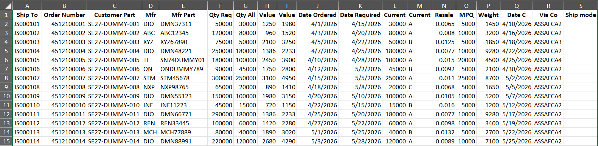
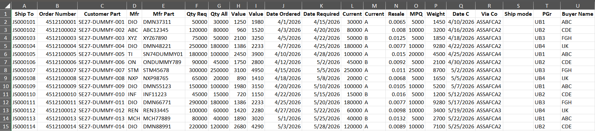
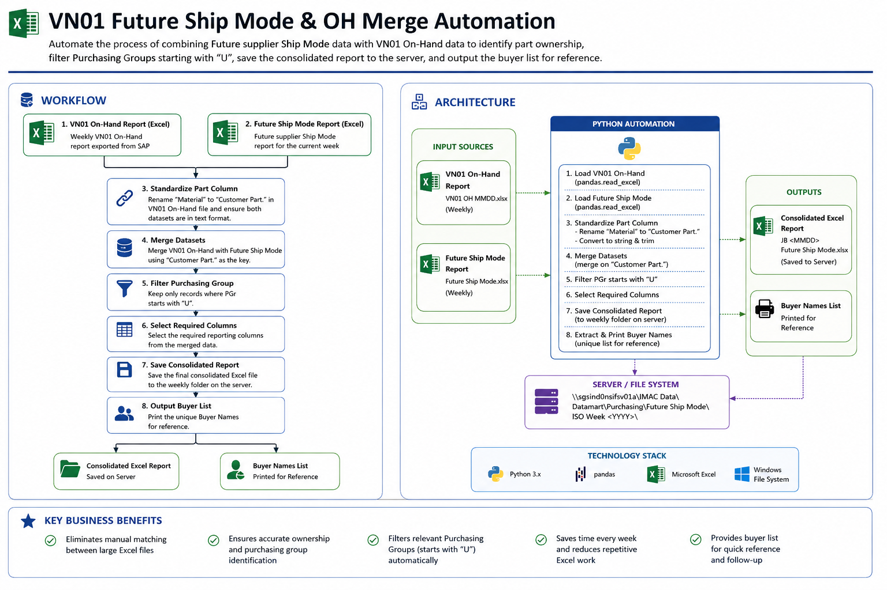
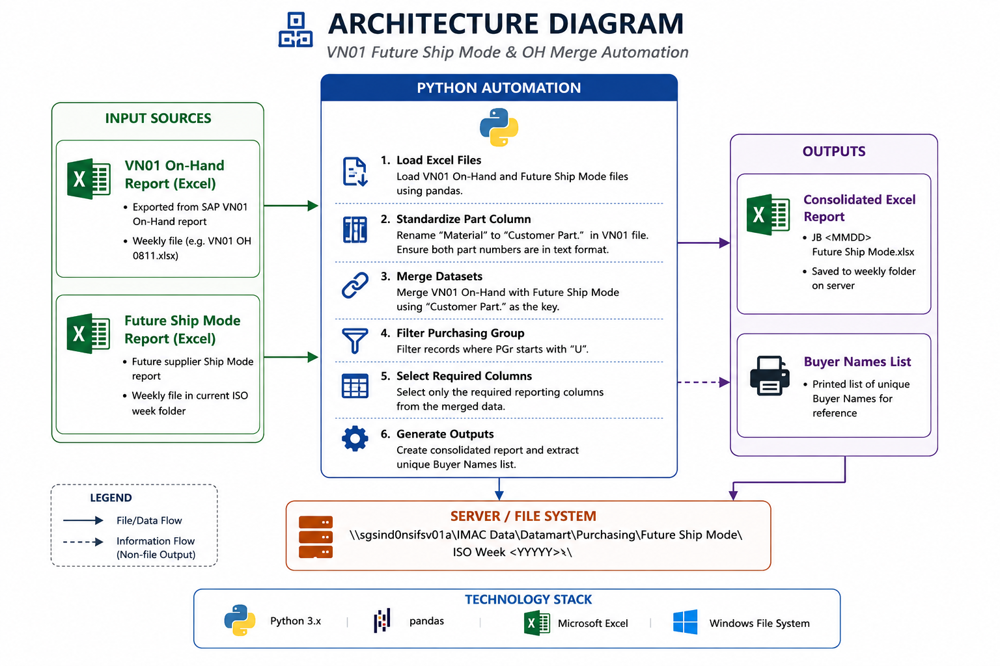

# VN01 Future Ship Mode & OH Merge Automation


> Python automation for consolidating VN01 On-Hand data with Future Ship Mode data, matching Customer Parts, applying Purchasing Group filtering, and generating a consolidated Excel report.

---

## Overview

This project automates a weekly Purchasing reporting process involving two Excel reports:

1. **VN01 On-Hand (OH) report**
2. **Future Supplier Ship Mode (FSM) report**

The original process required the Purchasing user to manually combine the two reports, match parts, apply Purchasing Group filtering, prepare the final report, and identify the relevant Buyers.

The Python automation performs these repetitive data-processing steps automatically.

The automation:

- Loads the VN01 On-Hand report.
- Loads the Future Ship Mode report.
- Converts VN01 `Material` to `Customer Part.`.
- Matches the two datasets using `Customer Part.`.
- Retains `PGr` from the VN01 On-Hand report.
- Filters records where `PGr` starts with `U`.
- Generates the consolidated Excel report.
- Generates a Buyer reference list.

**Project Status:** Production

---

## Business Problem

The weekly VN01 Future Ship Mode process requires information from multiple Excel reports to be combined and filtered.

The original manual process involved:

- Opening the VN01 On-Hand report.
- Opening the Future Ship Mode report.
- Matching Customer Parts.
- Applying the required Purchasing Group filtering.
- Preparing the final consolidated report.
- Identifying the relevant Buyers.
- Saving the final report to the correct server location.

This created repetitive manual work and introduced the possibility of:

- Incorrect part matching.
- Incorrect Purchasing Group filtering.
- Manual data-processing errors.
- Inconsistent output.
- Additional processing time.

The automation was developed to standardize these steps and make the process repeatable.

---

# Before and After

## Before Automation

The original process required manual handling of the VN01 On-Hand and Future Ship Mode reports before producing the final Purchasing output.



---

## After Automation

The Python automation performs the matching, Purchasing Group filtering, and report generation automatically.



---

# Solution

The Python automation processes the two source Excel reports and produces the required Purchasing output.

### Process

1. Load the VN01 On-Hand report.
2. Load the Future Ship Mode report.
3. Convert VN01 `Material` to `Customer Part.`.
4. Match the two datasets using `Customer Part.`.
5. Retain `PGr` from the VN01 On-Hand report.
6. Filter records where `PGr` starts with `U`.
7. Generate the consolidated Excel report.
8. Generate a Buyer reference list.
9. Save the output to the designated server location.

---

# Key Features

### Automated Excel Processing

Loads and processes the VN01 On-Hand and Future Ship Mode Excel reports without requiring manual data copying between files.

### Customer Part Matching

The two reports are matched using:

---

# Workflow



The automation follows the workflow below:

1. VN01 On-Hand report is loaded.
2. Future Ship Mode report is loaded.
3. Input structures are validated.
4. VN01 `Material` is standardized as `Customer Part.`.
5. Both datasets are matched using `Customer Part.`.
6. VN01 `PGr` is retained in the merged dataset.
7. Records with `PGr` beginning with `U` are retained.
8. Required output columns are selected.
9. The consolidated Excel report is generated.
10. A unique Buyer list is generated.

---

# Architecture



The solution uses Python as the data-processing layer between the source Excel reports and the final Purchasing output.

## Architecture Components

| Component | Responsibility |
|---|---|
| VN01 On-Hand Excel | Provides VN01 part and Purchasing Group information |
| Future Ship Mode Excel | Provides Future shipment information |
| Python | Controls the automation workflow |
| pandas | Data processing, merging and filtering |
| openpyxl | Excel reading and writing |
| Server | Input and output file storage |
| Purchasing User | Initiates the required input process |

---

# SAP Boundary

The current Python automation does **not** directly extract the VN01 report from SAP.

The process starts after the VN01 On-Hand report has already been generated.

SAP
 │
 ▼
VN01 On-Hand Excel
 │
 ├──────────────────┐
 │                  │
 ▼                  ▼
Python          Future Ship Mode
Automation          Excel
 │
 ▼
Consolidated Report

---

# Lessons Learned

### Validate the Actual Input Structure

The actual report structure should be treated as the source of truth when designing the automation.

In this process, `PGr` belongs to the VN01 On-Hand report and is not required from the Future Ship Mode report.

### Keep Business Logic Simple

The required business flow is:

```text
VN01 On-Hand
      +
Future Ship Mode
      ↓
Match Customer Part.
      ↓
Retain VN01 PGr
      ↓
Filter PGr starting with U
      ↓
Generate Report
